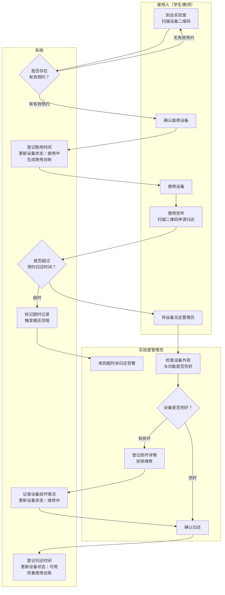

```mermaid
flowchart TD
    subgraph 使用人["使用人（学生/教师）"]
        U1[到达实验室<br/>扫描设备二维码]
        U2[确认取用设备]
        U3[使用设备]
        U4[使用完毕<br/>扫描二维码申请归还]
        U5[将设备交还管理员]
    end

    subgraph 系统
        Sys1{是否存在<br/>有效预约？}
        Sys2[登记取用时间<br/>更新设备状态：使用中<br/>生成使用台账]
        Sys3{是否超过<br/>预约归还时间？}
        Sys4[标记超时记录<br/>触发催还流程]
        Sys5[记录设备损坏情况<br/>更新设备状态：维修中]
        Sys6[登记归还时间<br/>更新设备状态：可用<br/>完善使用台账]
    end

    subgraph 实验室管理员
        A1[收到超时未归还告警]
        A2[检查设备外观<br/>与功能是否完好]
        A3{设备是否完好？}
        A4[登记损坏详情<br/>安排维修]
        A5[确认归还]
    end

    U1 --> Sys1
    Sys1 -- 无有效预约 --> U1
    Sys1 -- 有有效预约 --> U2
    U2 --> Sys2
    Sys2 --> U3
    U3 --> U4
    U4 --> Sys3
    Sys3 -- 超时 --> Sys4
    Sys4 --> A1
    Sys3 --> U5
    U5 --> A2
    A2 --> A3
    A3 -- 有损坏 --> A4
    A4 --> Sys5
    Sys5 --> A5
    A3 -- 完好 --> A5
    A5 --> Sys6
```