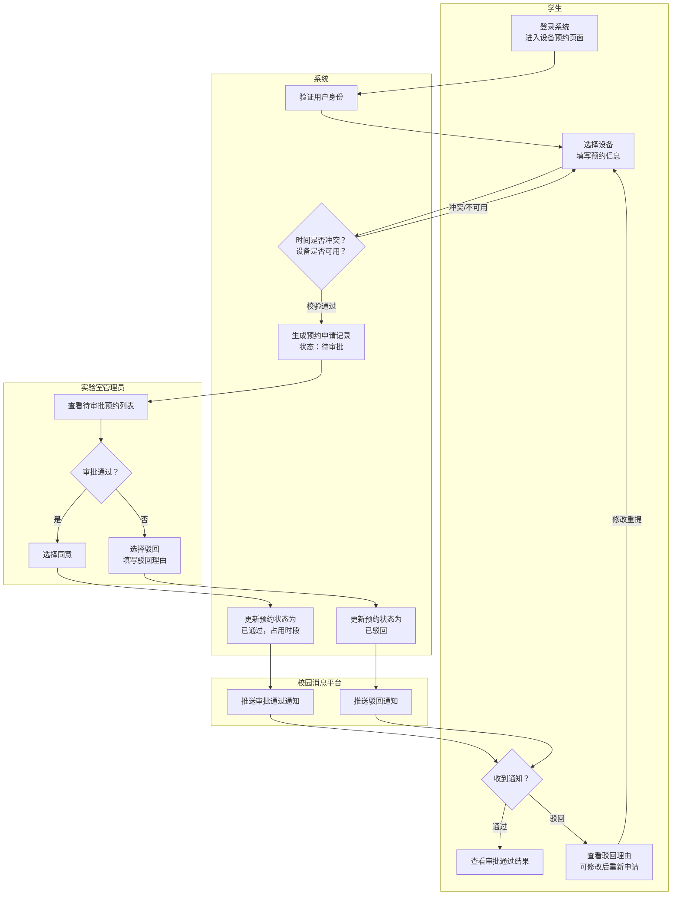

```mermaid
flowchart TD
    subgraph 学生
        S1[登录系统<br/>进入设备预约页面]
        S2[选择设备<br/>填写预约信息]
        S3{收到通知？}
        S4[查看审批通过结果]
        S5[查看驳回理由<br/>可修改后重新申请]
    end

    subgraph 系统
        Sys1[验证用户身份]
        Sys2{时间是否冲突？<br/>设备是否可用？}
        Sys3[生成预约申请记录<br/>状态：待审批]
        Sys4[更新预约状态为<br/>已通过，占用时段]
        Sys5[更新预约状态为<br/>已驳回]
    end

    subgraph 实验室管理员
        A1[查看待审批预约列表]
        A2{审批通过？}
        A3[选择同意]
        A4[选择驳回<br/>填写驳回理由]
    end

    subgraph 校园消息平台
        M1[推送审批通过通知]
        M2[推送驳回通知]
    end

    S1 --> Sys1
    Sys1 --> S2
    S2 --> Sys2
    Sys2 -- 冲突/不可用 --> S2
    Sys2 -- 校验通过 --> Sys3
    Sys3 --> A1
    A1 --> A2
    A2 -- 是 --> A3
    A2 -- 否 --> A4
    A3 --> Sys4
    Sys4 --> M1
    M1 --> S3
    S3 -- 通过 --> S4
    A4 --> Sys5
    Sys5 --> M2
    M2 --> S3
    S3 -- 驳回 --> S5
    S5 -- 修改重提 --> S2
```