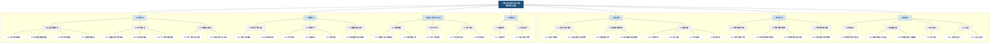

```mermaid
flowchart TB
    root["0 实验室设备预约与共享管理系统交付项目"]
    
    %% 左列：1-3
    subgraph left [ ]
        direction TB
        m1["1 项目管理"]
        m11["1.1 项目计划与监控"]
        m12["1.2 配置与版本管理"]
        m13["1.3 阶段评审"]
        m111["1.1.1 项目计划编制"]
        m112["1.1.2 进度监控与风险管理"]
        m121["1.2.1 配置管理计划"]
        m122["1.2.2 版本控制与基线管理"]
        m131["1.3.1 需求评审"]
        m132["1.3.2 设计评审"]
        m133["1.3.3 测试评审"]
        m134["1.3.4 验收评审"]
        m1 --- m11
        m1 --- m12
        m1 --- m13
        m11 --- m111
        m11 --- m112
        m12 --- m121
        m12 --- m122
        m13 --- m131
        m13 --- m132
        m13 --- m133
        m13 --- m134
        
        m2["2 需求分析"]
        m21["2.1 需求调研与分析"]
        m22["2.2 需求规格说明书"]
        m23["2.3 需求基线与变更"]
        m211["2.1.1 需求调研与分析"]
        m221["2.2.1 需求规格说明书编写"]
        m222["2.2.2 需求规格说明书评审"]
        m231["2.3.1 需求基线与变更控制"]
        m2 --- m21
        m2 --- m22
        m2 --- m23
        m21 --- m211
        m22 --- m221
        m22 --- m222
        m23 --- m231
        
        m3["3 系统设计"]
        m31["3.1 架构设计"]
        m32["3.2 数据库设计"]
        m33["3.3 接口设计"]
        m34["3.4 UI设计"]
        m311["3.1.1 系统架构与技术选型"]
        m321["3.2.1 概念结构设计(ER图)"]
        m322["3.2.2 逻辑结构设计(数据表)"]
        m331["3.3.1 接口设计"]
        m341["3.4.1 页面原型设计"]
        m342["3.4.2 UI设计评审"]
        m3 --- m31
        m3 --- m32
        m3 --- m33
        m3 --- m34
        m31 --- m311
        m32 --- m321
        m32 --- m322
        m33 --- m331
        m34 --- m341
        m34 --- m342
    end
    
    %% 右列：4-7
    subgraph right [ ]
        direction TB
        m4["4 系统开发"]
        m41["4.1 后台管理端开发"]
        m42["4.2 用户端开发"]
        m43["4.3 外部接口集成"]
        m411["4.1.1 预约审批模块"]
        m412["4.1.2 设备信息管理模块"]
        m413["4.1.3 统计报表模块"]
        m414["4.1.4 催还管理模块"]
        m421["4.2.1 设备查询与预约模块"]
        m422["4.2.2 扫码登记模块"]
        m423["4.2.3 个人预约管理模块"]
        m431["4.3.1 统一身份认证对接"]
        m432["4.3.2 校园消息平台对接"]
        m4 --- m41
        m4 --- m42
        m4 --- m43
        m41 --- m411
        m41 --- m412
        m41 --- m413
        m41 --- m414
        m42 --- m421
        m42 --- m422
        m42 --- m423
        m43 --- m431
        m43 --- m432
        
        m5["5 系统测试"]
        m51["5.1 测试计划与设计"]
        m52["5.2 测试执行"]
        m53["5.3 缺陷管理与回归"]
        m511["5.1.1 测试计划编制"]
        m512["5.1.2 测试用例设计"]
        m521["5.2.1 单元测试"]
        m522["5.2.2 集成测试"]
        m523["5.2.3 系统测试"]
        m531["5.3.1 缺陷管理与回归测试"]
        m5 --- m51
        m5 --- m52
        m5 --- m53
        m51 --- m511
        m51 --- m512
        m52 --- m521
        m52 --- m522
        m52 --- m523
        m53 --- m531
        
        m6["6 部署上线与用户培训"]
        m61["6.1 系统部署"]
        m62["6.2 用户文档"]
        m63["6.3 用户培训"]
        m611["6.1.1 部署方案与环境搭建"]
        m612["6.1.2 系统部署上线"]
        m621["6.2.1 用户手册编写"]
        m631["6.3.1 培训方案设计"]
        m632["6.3.2 培训实施"]
        m6 --- m61
        m6 --- m62
        m6 --- m63
        m61 --- m611
        m61 --- m612
        m62 --- m621
        m63 --- m631
        m63 --- m632
        
        m7["7 项目收尾"]
        m71["7.1 项目验收"]
        m72["7.2 项目总结"]
        m711["7.1.1 项目验收"]
        m721["7.2.1 项目总结与归档"]
        m7 --- m71
        m7 --- m72
        m71 --- m711
        m72 --- m721
    end
    
    root --- m1
    root --- m2
    root --- m3
    root --- m4
    root --- m5
    root --- m6
    root --- m7
    
    classDef root fill:#1F4E79,stroke:#1F4E79,color:#fff,font-weight:bold
    classDef lv1 fill:#D6E4F0,stroke:#5B9BD5,color:#1F4E79,font-weight:bold
    classDef lv2 fill:#F2F2F2,stroke:#BFBFBF,color:#333
    classDef lv3 fill:#FFFFFF,stroke:#BFBFBF,color:#333
    classDef subgraphStyle fill:none,stroke:none
    
    class root root
    class m1,m2,m3,m4,m5,m6,m7 lv1
    class m11,m12,m13,m21,m22,m23,m31,m32,m33,m34,m41,m42,m43,m51,m52,m53,m61,m62,m63,m71,m72 lv2
    class m111,m112,m121,m122,m131,m132,m133,m134,m211,m221,m222,m231,m311,m321,m322,m331,m341,m342,m411,m412,m413,m414,m421,m422,m423,m431,m432,m511,m512,m521,m522,m523,m531,m611,m612,m621,m631,m632,m711,m721 lv3
```