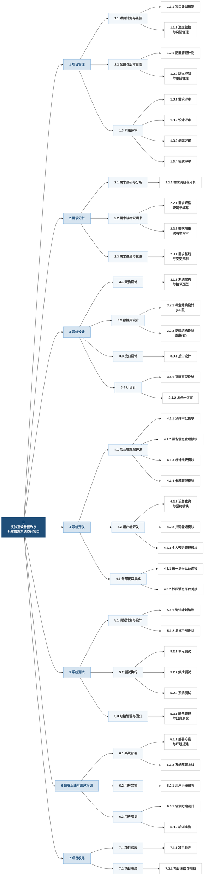

```mermaid
flowchart LR
    root["0<br/>实验室设备预约与<br/>共享管理系统交付项目"]
    
    %% 第1层
    m1["1 项目管理"]
    m2["2 需求分析"]
    m3["3 系统设计"]
    m4["4 系统开发"]
    m5["5 系统测试"]
    m6["6 部署上线与用户培训"]
    m7["7 项目收尾"]
    
    root --> m1
    root --> m2
    root --> m3
    root --> m4
    root --> m5
    root --> m6
    root --> m7
    
    %% 1 项目管理
    m1 --> m11["1.1 项目计划与监控"]
    m1 --> m12["1.2 配置与版本管理"]
    m1 --> m13["1.3 阶段评审"]
    m11 --> m111["1.1.1 项目计划编制"]
    m11 --> m112["1.1.2 进度监控<br/>与风险管理"]
    m12 --> m121["1.2.1 配置管理计划"]
    m12 --> m122["1.2.2 版本控制<br/>与基线管理"]
    m13 --> m131["1.3.1 需求评审"]
    m13 --> m132["1.3.2 设计评审"]
    m13 --> m133["1.3.3 测试评审"]
    m13 --> m134["1.3.4 验收评审"]
    
    %% 2 需求分析
    m2 --> m21["2.1 需求调研与分析"]
    m2 --> m22["2.2 需求规格说明书"]
    m2 --> m23["2.3 需求基线与变更"]
    m21 --> m211["2.1.1 需求调研与分析"]
    m22 --> m221["2.2.1 需求规格<br/>说明书编写"]
    m22 --> m222["2.2.2 需求规格<br/>说明书评审"]
    m23 --> m231["2.3.1 需求基线<br/>与变更控制"]
    
    %% 3 系统设计
    m3 --> m31["3.1 架构设计"]
    m3 --> m32["3.2 数据库设计"]
    m3 --> m33["3.3 接口设计"]
    m3 --> m34["3.4 UI设计"]
    m31 --> m311["3.1.1 系统架构<br/>与技术选型"]
    m32 --> m321["3.2.1 概念结构设计<br/>(ER图)"]
    m32 --> m322["3.2.2 逻辑结构设计<br/>(数据表)"]
    m33 --> m331["3.3.1 接口设计"]
    m34 --> m341["3.4.1 页面原型设计"]
    m34 --> m342["3.4.2 UI设计评审"]
    
    %% 4 系统开发
    m4 --> m41["4.1 后台管理端开发"]
    m4 --> m42["4.2 用户端开发"]
    m4 --> m43["4.3 外部接口集成"]
    m41 --> m411["4.1.1 预约审批模块"]
    m41 --> m412["4.1.2 设备信息管理模块"]
    m41 --> m413["4.1.3 统计报表模块"]
    m41 --> m414["4.1.4 催还管理模块"]
    m42 --> m421["4.2.1 设备查询<br/>与预约模块"]
    m42 --> m422["4.2.2 扫码登记模块"]
    m42 --> m423["4.2.3 个人预约管理模块"]
    m43 --> m431["4.3.1 统一身份认证对接"]
    m43 --> m432["4.3.2 校园消息平台对接"]
    
    %% 5 系统测试
    m5 --> m51["5.1 测试计划与设计"]
    m5 --> m52["5.2 测试执行"]
    m5 --> m53["5.3 缺陷管理与回归"]
    m51 --> m511["5.1.1 测试计划编制"]
    m51 --> m512["5.1.2 测试用例设计"]
    m52 --> m521["5.2.1 单元测试"]
    m52 --> m522["5.2.2 集成测试"]
    m52 --> m523["5.2.3 系统测试"]
    m53 --> m531["5.3.1 缺陷管理<br/>与回归测试"]
    
    %% 6 部署上线与用户培训
    m6 --> m61["6.1 系统部署"]
    m6 --> m62["6.2 用户文档"]
    m6 --> m63["6.3 用户培训"]
    m61 --> m611["6.1.1 部署方案<br/>与环境搭建"]
    m61 --> m612["6.1.2 系统部署上线"]
    m62 --> m621["6.2.1 用户手册编写"]
    m63 --> m631["6.3.1 培训方案设计"]
    m63 --> m632["6.3.2 培训实施"]
    
    %% 7 项目收尾
    m7 --> m71["7.1 项目验收"]
    m7 --> m72["7.2 项目总结"]
    m71 --> m711["7.1.1 项目验收"]
    m72 --> m721["7.2.1 项目总结与归档"]
    
    %% 样式
    classDef root fill:#1F4E79,stroke:#1F4E79,color:#fff,font-weight:bold
    classDef lv1 fill:#D6E4F0,stroke:#5B9BD5,color:#1F4E79,font-weight:bold
    classDef lv2 fill:#F2F7FB,stroke:#9DC3E6,color:#333
    classDef lv3 fill:#fff,stroke:#BFBFBF,color:#333
    
    class root root
    class m1,m2,m3,m4,m5,m6,m7 lv1
    class m11,m12,m13,m21,m22,m23,m31,m32,m33,m34,m41,m42,m43,m51,m52,m53,m61,m62,m63,m71,m72 lv2
    class m111,m112,m121,m122,m131,m132,m133,m134,m211,m221,m222,m231,m311,m321,m322,m331,m341,m342,m411,m412,m413,m414,m421,m422,m423,m431,m432,m511,m512,m521,m522,m523,m531,m611,m612,m621,m631,m632,m711,m721 lv3
```