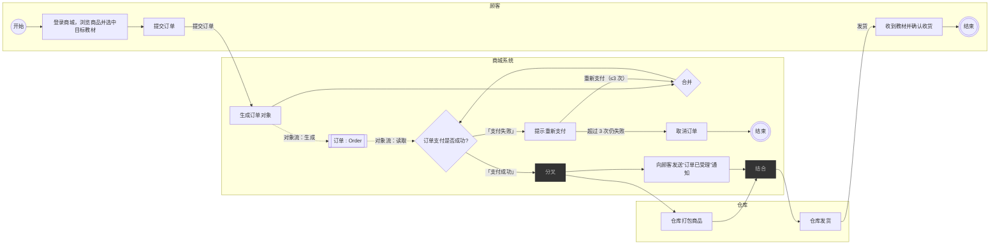

```mermaid
flowchart LR
    %% ================= 泳道一：顾客 =================
    subgraph CUSTOMER["顾客"]
        direction TB
        start((开始))
        browse[登录商城，浏览商品并选中目标教材]
        submit[提交订单]
        receive[收到教材并确认收货]
        endC(((结束)))
        start --> browse --> submit
        receive --> endC
    end

    %% ================= 泳道二：商城系统 =================
    subgraph SHOP["商城系统"]
        direction TB
        createOrder[生成订单对象]
        orderObj[["订单 : Order"]]
        mergePay{合并}
        payCheck{订单支付是否成功?}
        retry[提示重新支付]
        cancel[取消订单]
        endS(((结束)))
        forkNode[分叉]:::bar
        notify[向顾客发送“订单已受理”通知]
        joinNode[结合]:::bar

        createOrder -. "对象流：生成" .-> orderObj
        createOrder --> mergePay
        mergePay --> payCheck
        payCheck -->|"「支付失败」"| retry
        retry -->|"重新支付（≤3 次）"| mergePay
        retry -->|"超过 3 次仍失败"| cancel
        cancel --> endS
        payCheck -->|"「支付成功」"| forkNode
        orderObj -. "对象流：读取" .-> payCheck
        forkNode --> notify --> joinNode
    end

    %% ================= 泳道三：仓库 =================
    subgraph STORE["仓库"]
        direction TB
        pack[仓库打包商品]
        ship[仓库发货]
    end

    %% ================= 跨泳道控制流 =================
    submit -->|"提交订单"| createOrder
    forkNode --> pack
    pack --> joinNode
    joinNode --> ship
    ship -->|"发货"| receive

    classDef bar fill:#333,stroke:#333,stroke-width:2px,color:#fff;a
```