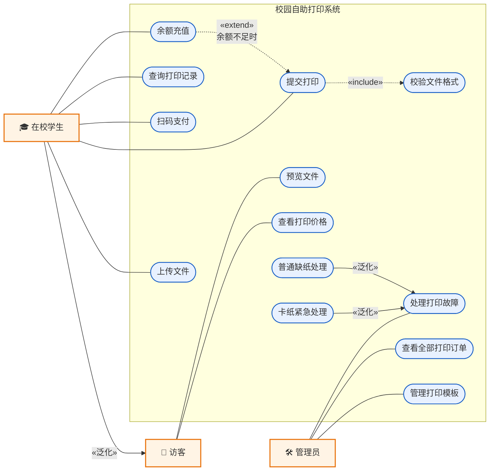

```mermaid
flowchart LR
    %% ===== 参与者 =====
    Visitor["👤 访客"]
    Student["🎓 在校学生"]
    Admin["🛠️ 管理员"]

    %% 参与者泛化：在校学生继承访客的全部用例
    Student -->|"«泛化»"| Visitor

    subgraph SYS["校园自助打印系统"]
        direction TB

        UC1(["查看打印价格"])
        UC2(["预览文件"])
        UC3(["上传文件"])
        UC4(["提交打印"])
        UC5(["扫码支付"])
        UC6(["查询打印记录"])
        UC7(["校验文件格式"])
        UC8(["余额充值"])
        UC9(["管理打印模板"])
        UC10(["查看全部打印订单"])
        UC11(["处理打印故障"])
        UC12(["普通缺纸处理"])
        UC13(["卡纸紧急处理"])

        %% 用例泛化
        UC12 -->|"«泛化»"| UC11
        UC13 -->|"«泛化»"| UC11

        %% 包含 / 扩展
        UC4 -.->|"«include»"| UC7
        UC8 -.->|"«extend»<br/>余额不足时"| UC4
    end

    %% ===== 关联关系 =====
    Visitor --- UC1
    Visitor --- UC2
    Student --- UC3
    Student --- UC4
    Student --- UC5
    Student --- UC6
    Student --- UC8
    Admin --- UC9
    Admin --- UC10
    Admin --- UC11

    classDef actor fill:#FFF4E5,stroke:#E8710A,stroke-width:2px,color:#333
    classDef uc fill:#E8F1FF,stroke:#1E63C7,stroke-width:1.5px,color:#333
    class Visitor,Student,Admin actor
    class UC1,UC2,UC3,UC4,UC5,UC6,UC7,UC8,UC9,UC10,UC11,UC12,UC13 uc
```