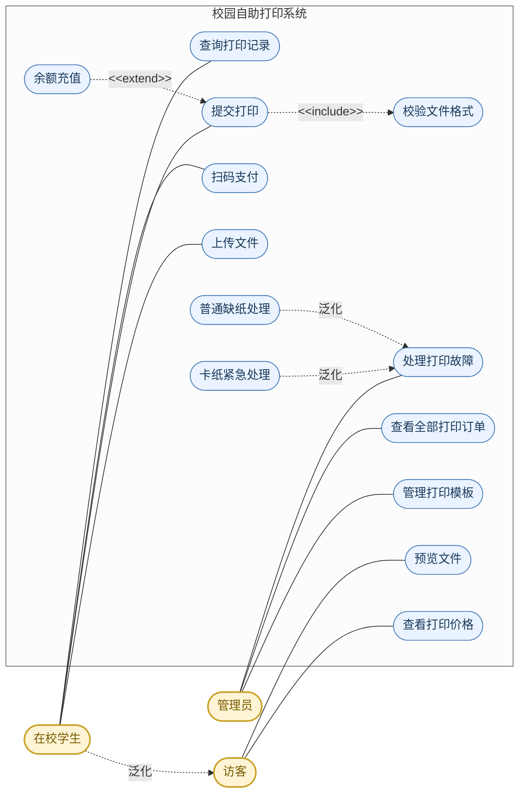

```mermaid
flowchart LR
    %% ===== 参与者 =====
    V(["访客"])
    S(["在校学生"])
    A(["管理员"])

    %% 参与者泛化：在校学生 继承 访客
    S -.->|"泛化"| V

    subgraph SYS["校园自助打印系统"]
        direction TB
        UC1(["查看打印价格"])
        UC2(["预览文件"])
        UC3(["上传文件"])
        UC4(["提交打印"])
        UC5(["扫码支付"])
        UC6(["查询打印记录"])
        UC7(["校验文件格式"])
        UC8(["余额充值"])
        UC9(["管理打印模板"])
        UC10(["查看全部打印订单"])
        UC11(["处理打印故障"])
        UC12(["普通缺纸处理"])
        UC13(["卡纸紧急处理"])

        %% 强制步骤：包含关系
        UC4 -.->|"&lt;&lt;include&gt;&gt;"| UC7
        %% 余额不足才触发：扩展关系（箭头由扩展用例指向基用例）
        UC8 -.->|"&lt;&lt;extend&gt;&gt;"| UC4
        %% 用例泛化：两个子用例 → 父用例
        UC12 -.->|"泛化"| UC11
        UC13 -.->|"泛化"| UC11
    end

    V --- UC1
    V --- UC2
    S --- UC3
    S --- UC4
    S --- UC5
    S --- UC6
    A --- UC9
    A --- UC10
    A --- UC11

    classDef actor fill:#FFF4D6,stroke:#C9A227,stroke-width:2px,color:#7A5C00
    classDef uc fill:#EAF3FF,stroke:#4A7EBB,color:#1B3A5C
    class V,S,A actor
    class UC1,UC2,UC3,UC4,UC5,UC6,UC7,UC8,UC9,UC10,UC11,UC12,UC13 uc
    style SYS fill:#FCFCFC,stroke:#666666

```