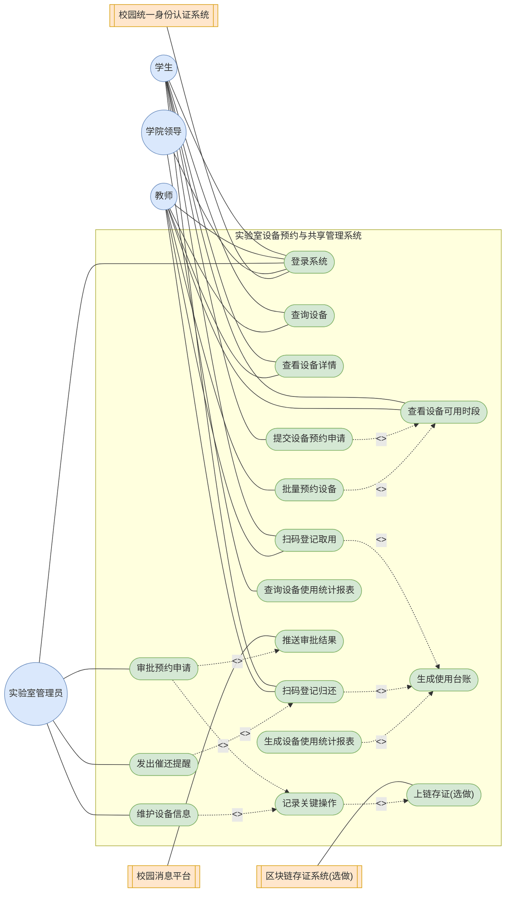

```mermaid
flowchart LR
    %% 参与者
    Student(("学生"))
    Teacher(("教师"))
    Admin(("实验室管理员"))
    Leader(("学院领导"))
    AuthSys[["校园统一身份认证系统"]]
    MsgSys[["校园消息平台"]]
    ChainSys[["区块链存证系统(选做)"]]

    %% 系统边界
    subgraph System["实验室设备预约与共享管理系统"]
        UC1(["登录系统"])
        UC2(["查询设备"])
        UC3(["查看设备详情"])
        UC4(["查看设备可用时段"])
        UC5(["提交设备预约申请"])
        UC6(["批量预约设备"])
        UC7(["审批预约申请"])
        UC8(["维护设备信息"])
        UC9(["发出催还提醒"])
        UC10(["扫码登记取用"])
        UC11(["扫码登记归还"])
        UC12(["生成使用台账"])
        UC13(["生成设备使用统计报表"])
        UC14(["查询设备使用统计报表"])
        UC15(["推送审批结果"])
        UC16(["记录关键操作"])
        UC17(["上链存证(选做)"])
    end

    %% 参与者与用例
    Student --- UC1
    Student --- UC2
    Student --- UC3
    Student --- UC4
    Student --- UC5
    Student --- UC10
    Student --- UC11

    Teacher --- UC1
    Teacher --- UC2
    Teacher --- UC3
    Teacher --- UC4
    Teacher --- UC6
    Teacher --- UC10
    Teacher --- UC11

    Admin --- UC1
    Admin --- UC7
    Admin --- UC8
    Admin --- UC9

    Leader --- UC1
    Leader --- UC14

    AuthSys --- UC1
    MsgSys --- UC15
    ChainSys --- UC17

    %% include
    UC5 -. "<<include>>" .-> UC4
    UC6 -. "<<include>>" .-> UC4
    UC7 -. "<<include>>" .-> UC15
    UC10 -. "<<include>>" .-> UC12
    UC11 -. "<<include>>" .-> UC12
    UC13 -. "<<include>>" .-> UC12
    UC16 -. "<<include>>" .-> UC17

    %% extend
    UC9 -. "<<extend>>" .-> UC11
    UC7 -. "<<extend>>" .-> UC16
    UC8 -. "<<extend>>" .-> UC16

    %% 样式
    classDef actor fill:#dae8fc,stroke:#6c8ebf,stroke-width:1px;
    classDef ext fill:#ffe6cc,stroke:#d79b00,stroke-width:1px;
    classDef uc fill:#d5e8d4,stroke:#82b366,stroke-width:1px;
    class Student,Teacher,Admin,Leader actor;
    class AuthSys,MsgSys,ChainSys ext;
    class UC1,UC2,UC3,UC4,UC5,UC6,UC7,UC8,UC9,UC10,UC11,UC12,UC13,UC14,UC15,UC16,UC17 uc;
```