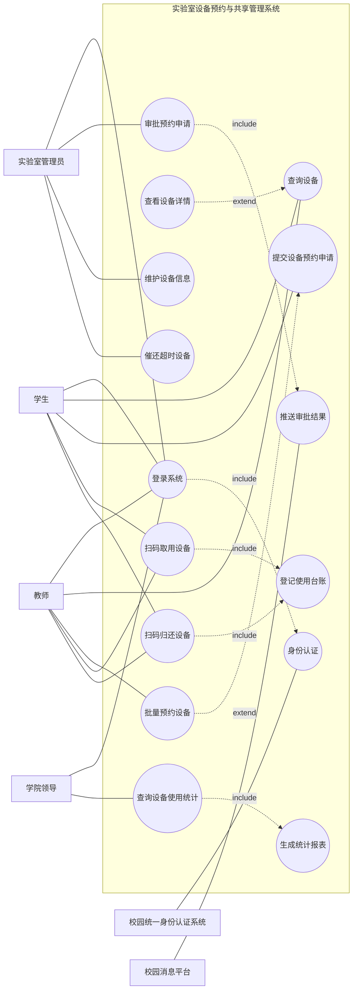

```mermaid
flowchart LR
    Student["学生"]
    Teacher["教师"]
    Admin["实验室管理员"]
    Leader["学院领导"]
    AuthSys["校园统一身份认证系统"]
    MsgSys["校园消息平台"]

    subgraph System["实验室设备预约与共享管理系统"]
        UC1(("登录系统"))
        UC2(("身份认证"))
        UC3(("查询设备"))
        UC4(("查看设备详情"))
        UC5(("提交设备预约申请"))
        UC6(("批量预约设备"))
        UC7(("审批预约申请"))
        UC8(("推送审批结果"))
        UC9(("维护设备信息"))
        UC10(("催还超时设备"))
        UC11(("扫码取用设备"))
        UC12(("扫码归还设备"))
        UC13(("登记使用台账"))
        UC14(("查询设备使用统计"))
        UC15(("生成统计报表"))
    end

    Student --- UC1
    Student --- UC3
    Student --- UC5
    Student --- UC11
    Student --- UC12

    Teacher --- UC1
    Teacher --- UC3
    Teacher --- UC6
    Teacher --- UC11
    Teacher --- UC12

    Admin --- UC1
    Admin --- UC7
    Admin --- UC9
    Admin --- UC10

    Leader --- UC1
    Leader --- UC14

    AuthSys --- UC2
    MsgSys --- UC8

    UC1 -.->|"include"| UC2
    UC7 -.->|"include"| UC8
    UC11 -.->|"include"| UC13
    UC12 -.->|"include"| UC13
    UC14 -.->|"include"| UC15

    UC4 -.->|"extend"| UC3
    UC6 -.->|"extend"| UC5

```